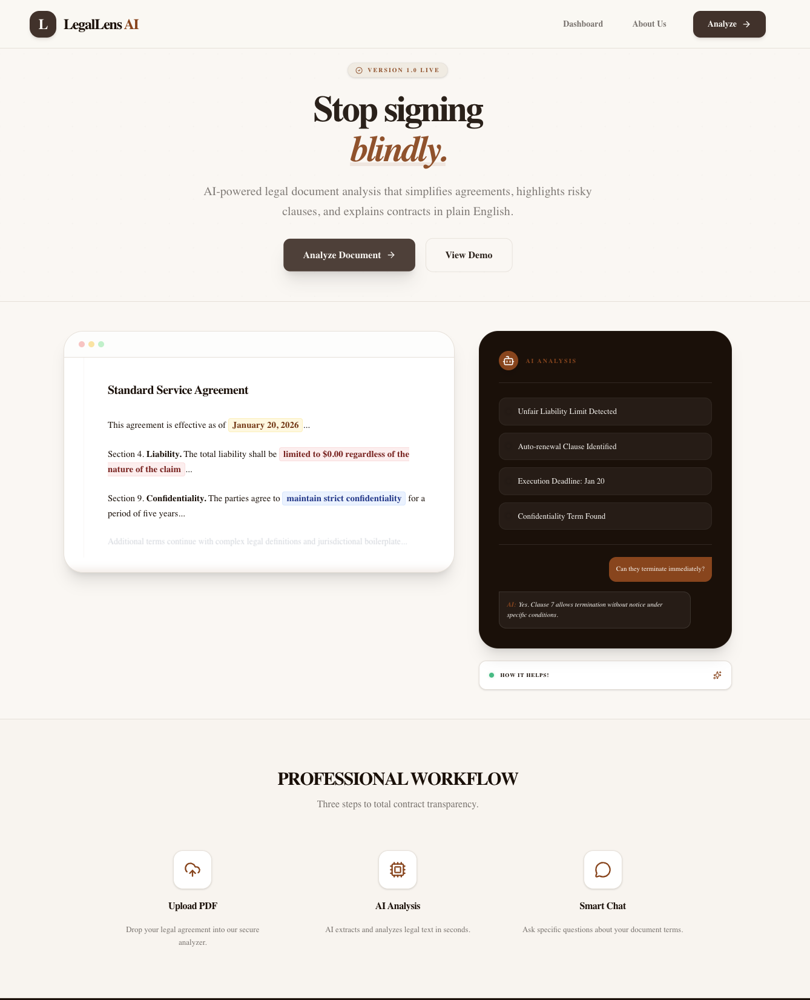
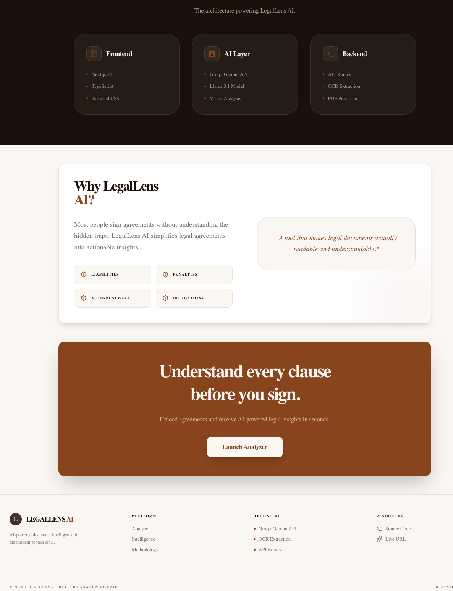
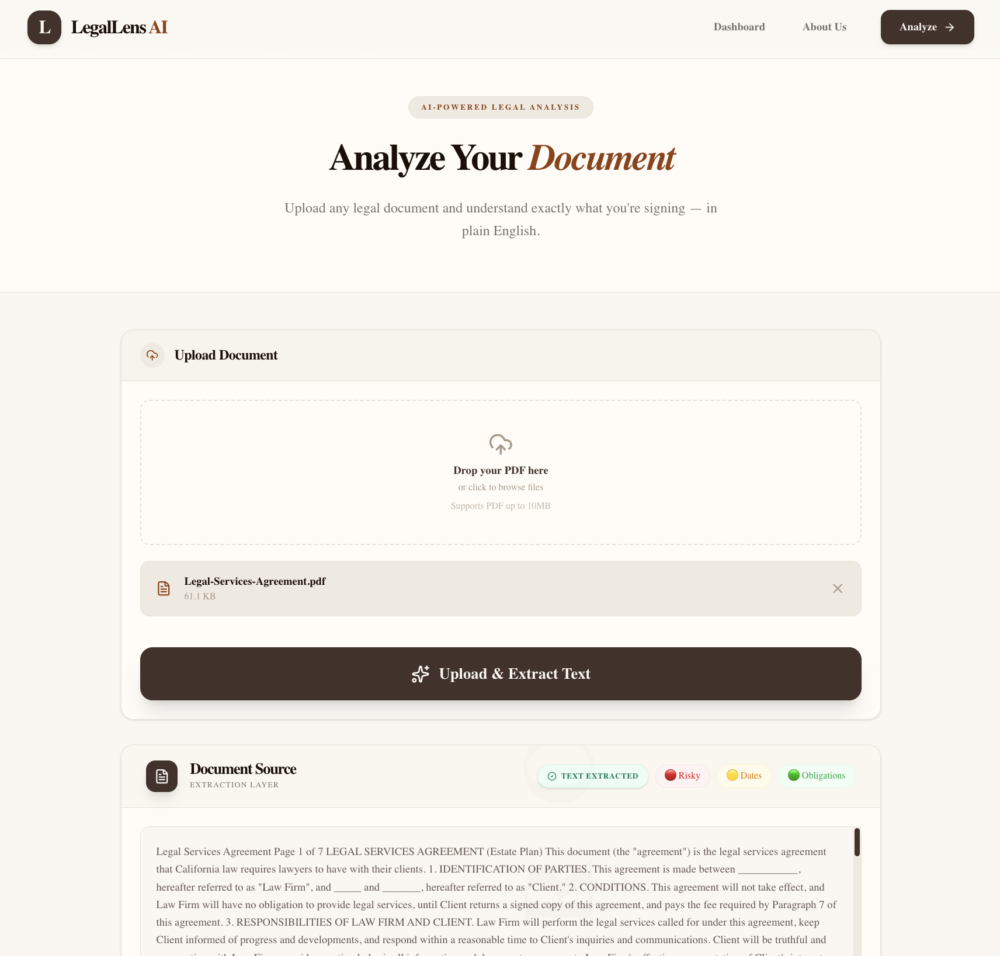
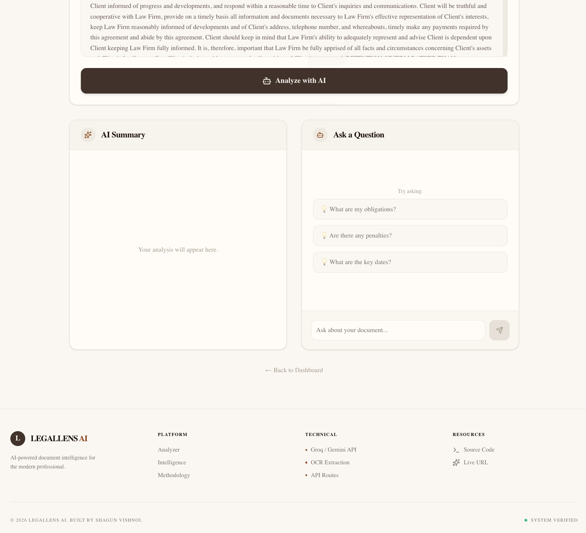
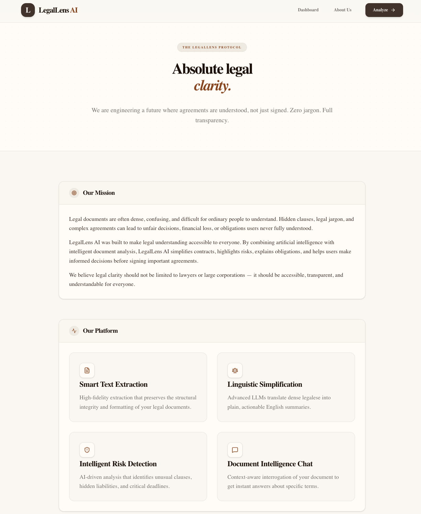
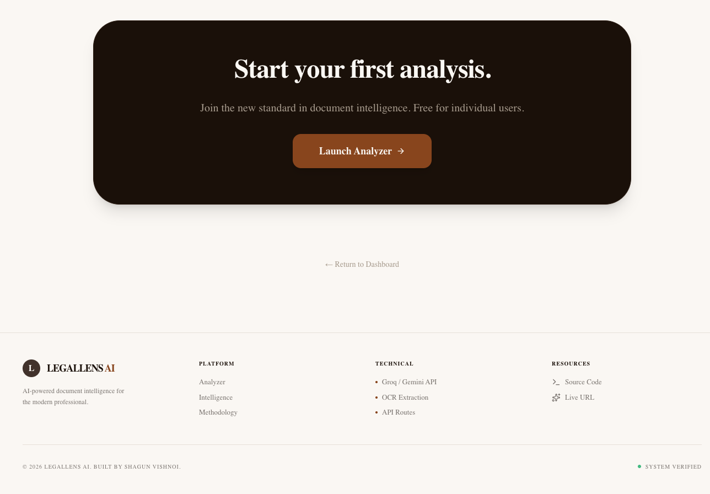

# LegalLens AI 


### Intelligent Legal Document Analysis & Simplification Platform

LegalLens AI is an AI-powered legal document analysis platform designed to simplify complex agreements into understandable insights.

The platform helps users upload legal documents, extract important clauses, identify risks, and interact with contracts using AI-powered analysis and conversational document understanding.

Version 1 focuses on:
- AI-powered legal analysis
- clause highlighting
- OCR/text extraction
- document-based AI chat
- plain-English simplification

---

#  Features

##  AI Legal Analysis
Generate simplified summaries of complex legal agreements using AI.

##  Risk Detection
Identify potentially risky or unfair clauses including:
- liabilities
- penalties
- termination conditions
- auto-renewal clauses

##  AI Chat With Document
Ask questions about uploaded agreements and receive context-aware answers based on the document.

##  Plain-English Simplification
Convert difficult legal language into beginner-friendly explanations.

##  Smart Clause Highlighting
Highlight:
- risky clauses
- important dates
- obligations
- deadlines

##  PDF Text Extraction
Extract text from uploaded legal PDF documents for downstream AI analysis.

---

#  System Architecture

```txt
PDF Upload
   ↓
Text Extraction
   ↓
AI Processing
   ↓
Risk & Clause Analysis
   ↓
Interactive AI Chat
```

#  Tech Stack

## Frontend
- Next.js 16
- TypeScript
- Tailwind CSS
- Framer Motion

## AI Layer
- Groq SDK
- Llama 3.1 8B Instant
- Prompt Engineering

## Processing
- PDF Text Extraction (`unpdf`)
- Custom Highlight Detection

## UI
- Lucide React Icons
- Responsive SaaS-style Interface

#  Screenshots

## Landing Page



## Document Upload & Analysis



## AI Chat Interface



---

#  Live Demo

https://legal-lens-ai.vercel.app

---
#  Installation

## 1. Clone Repository

```bash
git clone https://github.com/shagunvishnoi/legal-lens-ai.git
cd legal-lens-ai
```

## 2. Install Dependencies

```bash
npm install
```

## 3. Environment Variables

Create a `.env.local` file in the root directory:

```env
GROQ_API_KEY=your_groq_api_key
```

## 4. Run Development Server

```bash
npm run dev
```

## 5. Open In Browser

```txt
http://localhost:3000
```

#  Future Improvements

Planned future upgrades include:
- Authentication system
- Database integration
- Document history
- Vector search & embeddings
- Multilingual legal analysis
- Semantic clause comparison
- Cloud document storage

---

#  Disclaimer

LegalLens AI provides AI-generated document analysis for informational and educational purposes only.

The platform does not provide official legal advice and should not replace consultation with a qualified legal professional.

For important legal decisions, always consult a licensed lawyer.

---

#  Author

Built by Shagun Vishnoi

GitHub:
https://github.com/shagunvishnoi/legal-lens-ai
